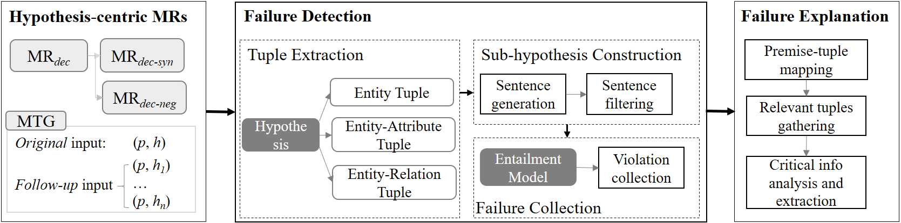
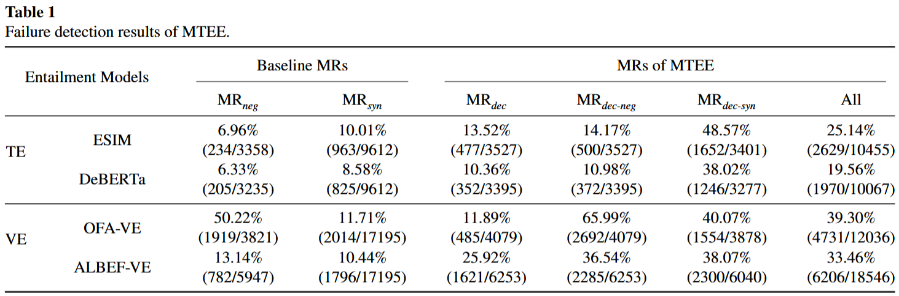

# Artifact for the paper "Metamorphic Testing for Textual and Visual Entailment: A Unified Framework for Model Evaluation and Explanation"
This repository contains data and code for the paper "Metamorphic Testing for Textual and Visual Entailment: A Unified Framework for Model Evaluation and Explanation"
#### Overview of MTEE

     
    
     

# Data

     
    
     

* The test results of the four models in our evaluation experiment.

# Code
* Code for tuple extraction and sentence generation using ChatGPT.
* Code for MTEE on four models(ESIM/DeBERTa/OFA-VE/ALBEF-VE).

# Link for model download
* [ESIM](https://github.com/coetaur0/ESIM)
* [DeBERTa](https://huggingface.co/cross-encoder/nli-deberta-v3-base)
* [OFA-VE](https://www.modelscope.cn/models/iic/ofa_visual-entailment_snli-ve_large_en/)
* [ALBEF-VE](https://github.com/salesforce/ALBEF)
#### The details of the experimental operating environment on different models can be found in:
* [ESIM/requirements.txt](ESIM/requirements.txt)
* [DeBERTa/requirements.txt](DeBERTa/requirements.txt)
* [OFA-VE/requirements.txt](OFA-VE/requirements.txt)
* [ALBEF-VE/requirements.txt](ALBEF-VE/requirements.txt)
